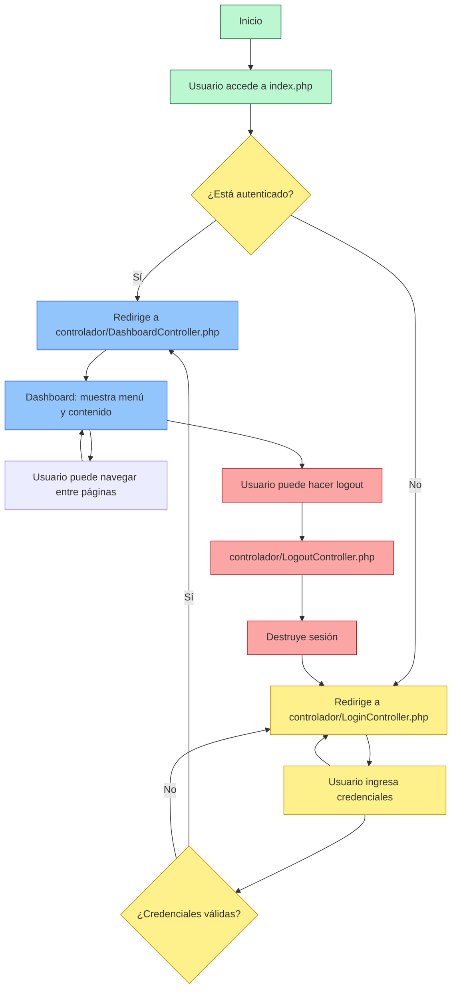

```mermaid
flowchart TD
    A[Inicio] --> B[Usuario accede a index.php]
    B --> C{¿Está autenticado?}
    C -- Sí --> D[Redirige a controlador/DashboardController.php]
    C -- No --> E[Redirige a controlador/LoginController.php]
    E --> F[Usuario ingresa credenciales]
    F --> G{¿Credenciales válidas?}
    G -- Sí --> D
    G -- No --> E
    D --> H[Dashboard: muestra menú y contenido]
    H --> I[Usuario puede navegar entre páginas]
    H --> J[Usuario puede hacer logout]
    J --> K[controlador/LogoutController.php]
    K --> L[Destruye sesión]
    L --> E
    I --> H
    F --> E
    style A fill:#bbf7d0,stroke:#166534
    style L fill:#fca5a5,stroke:#b91c1c
    style K fill:#fca5a5,stroke:#b91c1c
    style J fill:#fca5a5,stroke:#b91c1c
    style D fill:#93c5fd,stroke:#1d4ed8
    style H fill:#93c5fd,stroke:#1d4ed8
    style E fill:#fef08a,stroke:#ca8a04
    style F fill:#fef08a,stroke:#ca8a04
    style G fill:#fef08a,stroke:#ca8a04
    style C fill:#fef08a,stroke:#ca8a04
    style B fill:#bbf7d0,stroke:#166534
``` 